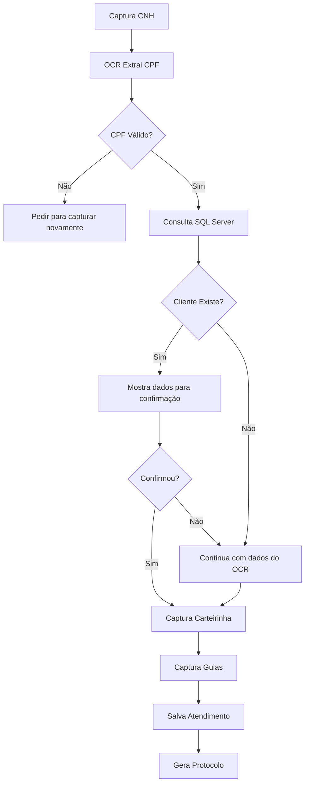

# Módulo Totem - Autoatendimento com OCR e Integração SQL Server

## 📖 Visão Geral

Este módulo é responsável por gerenciar o fluxo de autoatendimento no totem, incluindo:

- **Processamento OCR** de documentos (CNH/RG)
- **Consulta automática** de clientes no SQL Server legado
- **Confirmação de dados** do cliente
- **Captura de carteirinhas** de convênio
- **Salvamento completo** do atendimento

## 🏗️ Arquitetura

```
totem/
├── dto/
│   └── totem.dto.ts              # DTOs de entrada/saída
├── services/
│   └── sql-server.service.ts     # Serviço de integração SQL Server
├── totem.controller.ts           # Endpoints REST
├── totem.service.ts              # Lógica de negócio
└── totem.module.ts               # Módulo NestJS
```

## 📡 Endpoints

### 1. POST `/api/totem/processar-documento`

Processa documento (CNH/RG) com OCR e consulta cliente no SQL Server.

**Request:**
```json
{
  "imagem": "data:image/jpeg;base64,...",
  "dados_ocr": {
    "cpf": "12345678900",
    "nome": "JOAO SILVA",
    "rg": "123456789"
  }
}
```

**Response (Cliente Encontrado):**
```json
{
  "success": true,
  "cliente_encontrado": true,
  "dados_cliente": {
    "id": "12345",
    "nome": "João Silva Santos",
    "cpf": "12345678900",
    "telefone": "(11) 98765-4321",
    "endereco": "Rua Principal, 100"
  },
  "dados_ocr": { ... }
}
```

**Response (Cliente Novo):**
```json
{
  "success": true,
  "cliente_encontrado": false,
  "dados_ocr": {
    "cpf": "12345678900",
    "nome": "JOAO SILVA"
  },
  "mensagem": "Cliente não encontrado. Será realizado novo cadastro."
}
```

### 2. POST `/api/totem/processar-carteirinha`

Processa carteirinha de convênio com OCR.

**Request:**
```json
{
  "imagem": "data:image/jpeg;base64,...",
  "convenio": "unimed",
  "dados_ocr": {
    "numero_carteirinha": "123456789012"
  }
}
```

**Response:**
```json
{
  "success": true,
  "dados_carteirinha": {
    "numero_carteirinha": "123456789012",
    "convenio": "UNIMED",
    "validade": "12/2025"
  }
}
```

### 3. POST `/api/totem/salvar-atendimento`

Salva atendimento completo no banco de dados.

**Request:**
```json
{
  "cliente_id": "uuid-opcional",
  "dados_cliente": {
    "nome": "João Silva Santos",
    "cpf": "12345678900"
  },
  "convenio": "unimed",
  "dados_carteirinha": { ... },
  "imagem_documento": "base64...",
  "imagem_carteirinha": "base64...",
  "imagem_guias": "base64...",
  "cliente_confirmado": true
}
```

**Response:**
```json
{
  "success": true,
  "protocolo": "AT250420001",
  "atendimento_id": "uuid",
  "cliente_id": "uuid"
}
```

### 4. GET `/api/totem/teste-sql-server`

Testa conexão com SQL Server.

**Response:**
```json
{
  "success": true,
  "mensagem": "Conexão com SQL Server estabelecida com sucesso"
}
```

## 🔧 Serviços

### SqlServerService

Gerencia a conexão e consultas ao banco SQL Server legado.

**Métodos principais:**
- `testarConexao()` - Testa conexão
- `consultarClientePorCPF(cpf)` - Busca cliente por CPF
- `consultarClientePorRG(rg)` - Busca cliente por RG
- `buscarCliente(cpf, rg, nome)` - Busca com múltiplos critérios

**Configuração:**
```typescript
// Variáveis de ambiente necessárias
SQL_SERVER_HOST=localhost
SQL_SERVER_PORT=1433
SQL_SERVER_USER=sa
SQL_SERVER_PASSWORD=senha
SQL_SERVER_DATABASE=LaboratorioDB
```

### TotemService

Orquestra o fluxo de atendimento.

**Métodos principais:**
- `processarDocumento(dto)` - Processa CNH/RG com OCR e consulta SQL
- `processarCarteirinha(dto)` - Processa carteirinha com OCR
- `salvarAtendimento(dto)` - Salva tudo no PostgreSQL

## 🗄️ Modelos de Dados

### Paciente
```typescript
{
  id: string
  nomeCompleto: string
  cpf?: string
  dataNascimento?: Date
  rg?: string
  telefone?: string
  email?: string
  endereco?: string
  ativo: boolean
}
```

### Atendimento
```typescript
{
  id: string
  protocolo: string (único)
  pacienteId: string
  convenioId: string
  status: StatusAtendimento
  origem: 'TOTEM' | 'RECEPCAO'
  dadosCarteirinhaJson?: Json
  clienteConfirmado: boolean
}
```

### DocumentoCapturado
```typescript
{
  id: string
  atendimentoId: string
  tipo: string
  caminhoArquivo: string
  tamanhoBytes?: number
  metadadosJson?: Json
  status: StatusProcessamento
}
```

## 🔍 Fluxo de Processamento



## 🧪 Testes

### Teste Manual com cURL

```powershell
# 1. Testar SQL Server
curl http://localhost:3000/api/totem/teste-sql-server

# 2. Processar Documento
curl -X POST http://localhost:3000/api/totem/processar-documento `
  -H "Content-Type: application/json" `
  -d '{"imagem":"data:image/jpeg;base64,...","dados_ocr":{"cpf":"12345678900"}}'

# 3. Salvar Atendimento
curl -X POST http://localhost:3000/api/totem/salvar-atendimento `
  -H "Content-Type: application/json" `
  -d '@test-atendimento.json'
```

### Teste Automatizado

```typescript
import { Test } from '@nestjs/testing';
import { TotemService } from './totem.service';

describe('TotemService', () => {
  let service: TotemService;

  beforeEach(async () => {
    const module = await Test.createTestingModule({
      providers: [TotemService, ...],
    }).compile();

    service = module.get<TotemService>(TotemService);
  });

  it('deve processar documento e encontrar cliente', async () => {
    const resultado = await service.processarDocumento({
      imagem: 'base64...',
      dados_ocr: { cpf: '12345678900' }
    });

    expect(resultado.cliente_encontrado).toBe(true);
    expect(resultado.dados_cliente).toBeDefined();
  });
});
```

## 📊 Logs

O módulo gera logs em:

1. **Console** (desenvolvimento)
2. **Tabela log_sistema** (produção)

Exemplo de consulta de logs:
```sql
SELECT * FROM log_sistema 
WHERE modulo = 'TOTEM'
ORDER BY created_at DESC
LIMIT 50;
```

## ⚠️ Tratamento de Erros

### CPF não identificado
- **Causa:** Imagem de baixa qualidade
- **Ação:** Solicitar nova captura com melhor iluminação

### Cliente não encontrado
- **Causa:** CPF não existe no SQL Server
- **Ação:** Continuar com cadastro novo

### Erro de conexão SQL Server
- **Causa:** Credenciais incorretas ou servidor offline
- **Ação:** Verificar configurações .env e status do servidor

## 🔐 Segurança

- Conexões SQL Server usam pool de conexões
- Senhas armazenadas em variáveis de ambiente
- Validação de entrada com class-validator
- Sanitização de queries para prevenir SQL Injection
- Logs de auditoria de todas operações

## 📈 Performance

- Pool de conexões SQL Server (max: 10)
- Timeout de 30s para consultas
- Caching opcional com Redis
- Processamento assíncrono de imagens

## 🚀 Próximas Melhorias

- [ ] Sincronização bidirecional com SQL Server
- [ ] Validação de CPF com API externa
- [ ] OCR com múltiplos providers (fallback)
- [ ] Compressão de imagens antes do salvamento
- [ ] Dashboard em tempo real de atendimentos
- [ ] Notificações por SMS/Email

## 📞 Suporte

Para problemas ou dúvidas:
1. Verifique os logs: `SELECT * FROM log_sistema WHERE modulo = 'TOTEM'`
2. Teste conexão SQL Server: `/api/totem/teste-sql-server`
3. Consulte a documentação completa: `docs/OCR-INTEGRATION-GUIDE.md`
